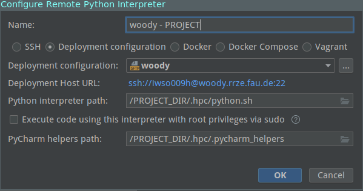

# HPC PyCharm Helper

This repository contains a collection of files and tools that enable a more interactive use of HPC services from within PyCharm. This allows you to develop and debug your programs from within PyCharm - no need to start interactive jobs from a separate SSH session anymore. There is also an option for submitting longer running jobs directly from within PyCharm

**Note**: Remote interpreters are only available in PyCharm Professional.

## WARNING for Windows users
Do not clone this repository on Windows! Git will change all line endings from `\n` to `\r\n` which will lead to problems when executing the `python.py` file on the HPC. Instead download the ZIP-version of this repository and unpack it (either directly on the HPC or in your local project directory. This should not change the line endings).

If the creation of the remote interpreter fails with the error `env: [PATH]/.hpc/python.sh: No such file or directory` and you are sure that `python.sh` exists at this path, it may be due to the line endings.

You can check this by executing `file python.sh` inside the .hpc-folder on the HPC (via SSH). If the output contains the information "CLRF line endings", you need to convert your files. You can do so by executing `dos2unix *` inside the .hpc folder. Make sure to not override these files (e.g. by automatic upload in PyCharm. Exclude the .hpc folder from your deployment configuration).

## IMPORTANT: Notes on Slurm vs Torque (October 2021)
RRZE is moving all nodes on TinyGPU from Torque scheduling to Slurm scheduling. Consult the HPC documentation for more information (e.g. current progress). As of October 2021 only GTX1080 GPUs can be accessed via Torque and are planned to be moved to Slurm by the end of 2021. The current version of the HPC PyCharm Helper supports both scheduling systems and uses Slurm by default for interactive jobs (use `run-torque` instead of `run` to use Torque). When submitting jobs, you can decide whether you want to use Slurm or Torque by either setting options via `--qsub` (Torque) or `--sbatch` (Slurm). If no options are specified, Slurm is used with the default settings (1 GPU, 6 hours).

## Setup
This guide assumes that you have an existing PyCharm project and want to connect it to the HPC.

0. Setup a SSH configuration in PyCharm (Settings > Tools > SSH Configurations). Host should be `woody.rrze.fau.de`.
1. Create a directory for your project on the HPC (e.g., in your HOME or in $WORK).
2. Clone this repository into `PROJECT_DIR/.hpc/` (on your local computer): `git clone git@mad-srv.informatik.uni-erlangen.de:av96ubyg/hpc-pycharm-helper.git .hpc`
3. Copy the `.hpc` folder into your project directory on the HPC.
4. Go to Settings > Project > Python Interpreter and add a new one (click the settings button on the top right). Choose "SSH Interpreter" and select the existing server configuration (see step 0). On the second page, choose the Interpreter (on HPC: `PROJECT_DIR/.hpc/python.sh`). Setup the sync folders - your project root should be synced to the project directory on the HPC. Note: you might need to run `cd .hpc && chmod +x *.sh` via SSH (e.g. Putty) on the HPC to make sure that the files are executable.
5. Once the new interpreter is added correctly, you should edit it. Since this interpreter only belongs to the current project, but is available globally, you might want to name it accordingly. You should also modify the PyCharm helpers path (see screenshot) and point it to `PROJECT_DIR/.hpc/.pycharm_helpers/`.
  5.1. Click on the three dots next to "deployment configuration". This should open a new window where you can set up the deployment configuration, i.e., tell PyCharm how and where to copy your files. You can set a "root path" (your project root on the HPC) if you don't want to use absolute paths in the other two settings tabs (mappings, excluded folders). Check whether the mappings are set correctly (leave web path empty). If you have some directories that should not be copied to/from the HPC, you can add them under "excluded paths". Always exclude your local .venv directory if you have one!
  5.2. If you want PyCharm to automatically upload files as you save them, make sure that your deployment configuration appears with bold font in the list on the left (this means that it is marked as default and PyCharm will upload project files using this configuration). You can toggle this setting by clicking the check mark above the list of configurations.
6. Enjoy. You should now be able to list installed packages from within the PyCharm settings (currently pip and setuptools), setup run configurations (see important details below) to run as interactive jobs on TinyGPU, use the PyCharm debug capabilities or submit jobs to the TinyGPU cluster.

## Configuration Options / Implementation Details

### Installing packages

The helper scripts automatically create a new Python venv when you first run it. You can install packages inside this venv using pip. There are several possibilities:
1. Install packages from within PyCharm (Settings > Project > Python Interpreter). You might need to check that the "path mappings" are set correctly (should be inherited from the deployment configurations).
2. You can install packages via SSH.
  2.1. In your project directory, run `.hpc/python.sh -m pip install <package_name>`. 
  2.2. In your project directory, activate the HPC Python module (`module load python/3.8-anaconda`), then activate the venv (`source venv/bin/activate`). Now you can run pip as usual (`pip install <...>`). 

### Running code on the woody frontend

This is the default option. If you just run your code using the remote interpreter, it will be executed on the woody frontend (without GPU support). This can be useful for downloading data from the internet as the compute nodes do not have access to the internet. It is also necessary for PyCharm to work properly (listing and installing packages, etc.).

### Running code on compute nodes

You can request an interactive node for debugging, by adding the option `--run` as an interpreter option in the run configuration dialog. If you now run this configuration, your code will be executed on a compute node with 1 GPU and killed after 60 minutes. You will see the output directly within PyCharm. You can also use this run configuration for debugging. If you click on `Debug` instead of `Run`, you will also request an interactive node, but some other stuff will also be run in the background to ensure that PyCharm can talk to the debugger running on the HPC (check out the "Behind the scenes: Debugging" section for more information).

**Important**: Make sure to uncheck "Run with Python Console" in your run configuration.

### Submitting a "real" job

It is also possible to set up a run configuration for submitting longer running non-interactive jobs to the HPC. This can be achieved by adding the interpreter option `--submit` (instead of `--run`). If you would now click on `Run`, your Python script would be queued for execution using some default parameters and Slurm.

You can modify the Slurm options by adding `--sbatch` like this: `--sbatch "--gres=gpu:1 --time=24:00:00 --job-name=my_awesome_job --output=output/%x.%j --mail-type=ALL"`. This example would request 1 GPU for 24 hours for a job called "my_awesome_job". Your job's output and errors will be written to a file in the folder output called "my_awesome_job.<job_id>" and requests information about all events (start, end, crash, etc.) via mail. You will receive these notifications on your FAU mail account, but can also specify a different mail address using `--mail-user=<email>`. Note that the A100 and V100 GPUs have their own queues which can be accessed by specifying `--gres=gpu:a100:1 -p a100` (Replace `a100` by `v100` for the V100 GPUs).

You can also use the old Torque scheduler (e.g. for accessing GTX1080 GPUs) by adding the `--qsub` option like this: `--qsub "-l nodes=1:ppn=8 -l walltime=24:00:00 -N job_name -m abe"`. This example would request 2 GPUs, run for 24 hours under then name "job_name" and inform you via mail when your job starts, aborts or ends. These are the only options that can be overwritten at the moment. Please also note that the walltime and number of nodes need to specified separately.

**Important**: Make sure to uncheck "Run with Python Console" in your run configuration.

### Current hard-coded default values
- We submit jobs to the TinyGPU cluster
- The walltime of the interactive job is fixed to 30 minutes (see ToDo below). The default for longer jobs is 6 hours.
- The scripts automatically create a Python venv (in `PROJECT_DIR/.venv/`) and uses the python interpreter and packages from there. Anaconda environments are not currently supported.
- We use Python 3.8 (newest version available on the HPC - apparently only option on Slurm-based nodes)
- Only works when set up to directly connect to `woody` (via lab network or VPN) - `cshpc` is not currently supported (Note: this might work for Slurm scheduling now but is untested)

### Behind the scenes: Debugging
By default, remote debugging in PyCharm works like this: PyCharm starts listening for connections on a random port on your local machine. To make this accessible to the remote server, PyCharm creates a remote port forwarding from the remote server to your local computer. PyCharm then launches a debugging wrapper script on the remote machine wich handles running/debugging your code as well as talking to your local PyCharm through the remote port forwarding. Note that anyone on the remote server could theoretically try to connect to your PyCharm instance running on your local computer!

This does not directly work on HPC, as the code is running on a compute node which cannot be accessed from outside the HPC, so we need to build a bridge:

#### SLURM
1. You click on Debug in PyCharm. PyCharm opens the remote port forwarding to woody (see above; by connecting locally to this port on woody, you actually connect to your local machine that runs PyCharm).
2. PyCharm tries to execute the debug wrapper remotely (on woody) using the helper `python.sh`. We intercept this and request a compute node. Once the compute node is available, we run `debugger.sh` (still on woody).
3. `debugger.sh` does two things: 1.) it runs `pydev_proxy_slurm.py` on woody. This program listens for a single connection on a random port which is forwarded to the compute node as the port decided by PyCharm. 2.) While the proxy is running in the background on woody, we execute your actual code (or rather the PyCharm debugging wrapper that will later execute your code) on the compute node. The debug wrapper tries to connect to the port decided by PyCharm which is forwarded to our proxy running on woody. This proxy accepts the first connection that it receives. Once this connection (debug wrapper to proxy) is established, the proxy connects to PyCharm (through the remote port forwarding created by PyCharm).
4. During this communication, PyCharm requests to open a second port (and sets up a forwarding from woody to your local machine). This is intercepted by the proxy and a second remote forwarding from the compute node to woody is created. The debug wrapper then tries to connect locally to this port and gets forwarded like this: compute node -> woody -> your local computer. We don't interecept this connection but actually rather use the same ports for both forwardings.

__NOTE that an attacker may be able to intercept this communication or try to connect to your locally running PyCharm instance!__
